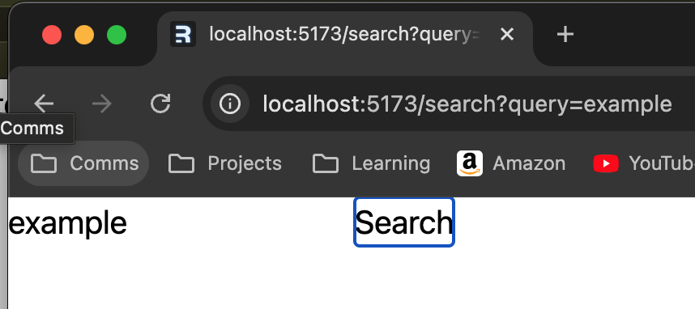

<!--
_class: invert
paginate: skip
-->


---

<!--
paginate: true
backgroundImage: url('https://marp.app/assets/hero-background.svg')
-->

<div class="columns">
<div class="columns-left">

# What's Remix?

</div>
 
<div class="columns-right">

Remix is a full stack web framework that lets you focus on the user interface and work back through web standards to deliver a fast, slick, and resilient user experience.

</div>
</div>
<footer>source: <a href="https://remix.run/">https://remix.run/</a></footer>

---

## What does that even mean?

The Remix Framework does several jobs and is built on top of React Router, Remix is four things:

1. A compiler
2. A server-side HTTP handler
3. A server framework
4. A browser framework

source: https://remix.run/docs/en/main/discussion/introduction

---

<div class="columns">
<div class="columns-left">

# Focus on server framework part

Similar to server-side MVC but Remix is more View and Controller, this means each route `/search` etc handles both these responsibilities.

</div>
 
<div class="columns-right">

These are handled by 3 primary exports from route files:

- `loader` - Loaders only run on the server and provide data to your component on GET requests
- `action` - Actions only run on the server and handle POST, PUT, PATCH, and DELETE. They can also provide data to the component
- `default` - The default export is the component that will be rendered when a route matches the URL. This runs both on the server and the client

</div>
</div>

---

<div class="columns">
<div class="columns-left">

# Making A Remix App

</div>
<div class="columns-right">

Goal: create a basic Remix app to demonstrate how to get started

</div>
</div>

---

# Setup

- Clone the repo: `git clone git@github.com:cbrannen9a/recipes-remix.git`

  - This is result of `npx create-remix@latest` and minor folder restructure

- Create Edamam (https://www.edamam.com/) api account for Free and signup for Recipe Search API
- Find `Application ID` and `Application Keys`
- Create a `.env.local` file
- Add `EDAMAM_APP_ID` and `EDAMAM_APP_KEY` properties and values
- Add following 2 additional properties:

```
    EDAMAM_BASE_URL=https://api.edamam.com
    EDAMAM_RECIPE_API_PATH=/api/recipes/v2
```

---

- `yarn add tiny-invariant` in terminal to add [`tiny-invariant`](https://www.npmjs.com/package/tiny-invariant) a helpful utility library for type narrowing
- Create following files/folders:

```
/app/lib/
/app/lib/edamam/index.ts
/app/lib/edamam/edamam.server.ts
```

---

- In `/app/lib/edamam/edamam.server.ts` create `getEdamam` function which will return a type safe set of environment keys uses `tiny-invariant` which can only used on server side to prevent api keys being leaked client side

```ts
import invariant from "tiny-invariant";

export function getEdamam() {
  invariant(
    process.env.EDAMAM_APP_ID,
    "Missing environment variable: EDAMAM_APP_ID"
  );
  invariant(
    process.env.EDAMAM_APP_KEY,
    "Missing environment variable: EDAMAM_APP_KEY"
  );
  invariant(
    process.env.EDAMAM_BASE_URL,
    "Missing environment variable: EDAMAM_BASE_URL"
  );
  invariant(
    process.env.EDAMAM_RECIPE__API_PATH,
    "Missing environment variable: EDAMAM_RECIPE__API_PATH"
  );

  return {
    EDAMAM_APP_ID: process.env.EDAMAM_APP_ID,
    EDAMAM_APP_KEY: process.env.EDAMAM_APP_KEY,
    EDAMAM_BASE_URL: process.env.EDAMAM_BASE_URL,
    EDAMAM_RECIPE__API_PATH: process.env.EDAMAM_RECIPE__API_PATH,
  };
}
```

---

- Create a folder `/app/routes/search`
- Add `route.tsx` to `search` folder
- Add `search.tsx` to `search` folder
- In `/search/route.tsx`

```ts
import { Search } from "./search";

export { Search as default };
```

---

- In `/search/search.tsx` create a basic form:

```ts
import { Form } from "@remix-run/react";

export function Search() {
  return (
    <Form>
      <input
        className="h-12"
        aria-label="search"
        name="query"
        type="text"
        placeholder="Search..."
      />
      <button type="submit">Search</button>
    </Form>
  );
}
```

---



Navigate to `/search` Entering a search value and submitting should generate just update the url with search params `/search?query=example`

---

- Route "routes/search" does not have a `loader` function, which gets data to create one in `/search/route.tsx`:

```ts
export function loader({ request }: LoaderFunctionArgs) {
  return null;
}
```

which creates a basic `loader` function

- In the browser network tab you can see the response from the server and the payload submitted

---

- Update `search/route.tsx` action function to:

```ts
export async function loader({ request }: LoaderFunctionArgs) {
  const url = new URL(request.url);
  const query = url.searchParams.get("query");

  if (!query) {
    return json({ recipes: null, query });
  }

  return null;
}
```

---

- Submitting an empty search won't error but no visual feedback is given. In `search/search.tsx` update to:

```ts
import { Form, useLoaderData } from "@remix-run/react";
import { loader } from "./route";

export function Search() {
  const { recipes, query } = useLoaderData<typeof loader>();

  return (
    <>
      <Form>
        <input
          defaultValue={query || ""}
          className="h-12 flex w-full justify-center rounded-md p-2 my-2"
          aria-label="search"
          name="query"
          type="text"
          placeholder="Search..."
        />
        <button
          className="flex w-full justify-center rounded-md bg-indigo-600 px-3 py-1.5 text-sm font-semibold leading-6 text-white shadow-sm hover:bg-indigo-500 focus-visible:outline focus-visible:outline-2 focus-visible:outline-offset-2 focus-visible:outline-indigo-600"
          type="submit"
        >
          Search
        </button>
      </Form>
      {recipes && recipes.length > 0 ? (
        <></>
      ) : (
        <>
          {query ? (
            <div>No recipes found</div>
          ) : (
            <div>Please enter a search term</div>
          )}
        </>
      )}
    </>
  );
}
```

---

This will prompt to ask for a search term

- It's now possible to curl and get the response back, in the terminal

```sh
curl 'http://localhost:5173/search?query=&_data=routes%2Fsearch'
```

---

- Add a new file `/search/queries.ts` to contain the logic for fetching data

```ts
import { getEdamam } from "~/lib/edamam";
import { RecipeType } from "~/types/edamam";

export async function getRecipes({ query }: { query: string }) {
  const {
    EDAMAM_APP_ID,
    EDAMAM_APP_KEY,
    EDAMAM_BASE_URL,
    EDAMAM_RECIPE_API_PATH,
  } = getEdamam();

  const response = await fetch(
    `${EDAMAM_BASE_URL}${EDAMAM_RECIPE_API_PATH}?type=public&q=${query}&app_id=${EDAMAM_APP_ID}&app_key=${EDAMAM_APP_KEY}&random=true`
  );
  const data = await response.json();

  const recipes: RecipeType[] = data.hits.map(
    ({
      recipe: { externalId, images, ingredients, label, url },
    }: {
      recipe: RecipeType;
    }) => {
      return {
        externalId,
        images,
        label,
        url,
        ingredients,
      };
    }
  );
  return recipes;
}
```

---

- Also create a folder `/app/types/edamam.ts` and add the following which are a set of types for edamam responses:

```ts
export interface RecipeType {
  externalId: string;
  url: string;
  label: string;
  images: Images;
  ingredients: Ingredient[];
}

export interface Images {
  REGULAR?: Image;
  SMALL?: Image;
  THUMBNAIL?: Image;
}

export interface Image {
  height: number;
  width: number;
  url: string;
}

export interface Ingredient {
  food: string;
  foodCategory: string;
  foodId: string;
  image: string;
  measure: string;
  quantity: number;
  text: string;
  weight: number;
}
```

---

- Then in `/search/route.tsx` update the loader to:

```tsx
import { json, LoaderFunctionArgs } from "@remix-run/node";
import { getRecipes } from "./queries";
import { Search } from "./search";

export async function loader({ request }: LoaderFunctionArgs) {
  const url = new URL(request.url);
  const query = url.searchParams.get("query");

  if (!query) {
    return json({ recipes: null, query });
  }

  const recipes = await getRecipes({ query });

  return json({ recipes, query });
}

export { Search as default };
```

---

- In `/search/search.tsx` update to render the returned results:

```tsx
...
</Form>
      {recipes && recipes.length > 0 ? (
        <ul className="divide-y divide-gray-100">
          {recipes.map(
            ({ externalId, label, url }, idx) => (
              <li
                className="flex justify-between gap-x-6 py-5"
                key={`${externalId}-${idx}`}
              >
                <a href={url}>{label}</a>
              </li>
            )
          )}
        </ul>
      ) : (
        <>
          {query ? (
...
```

- Entering a search term should now return a set of results

---
