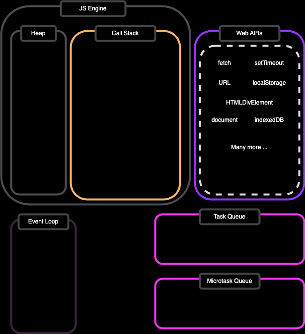
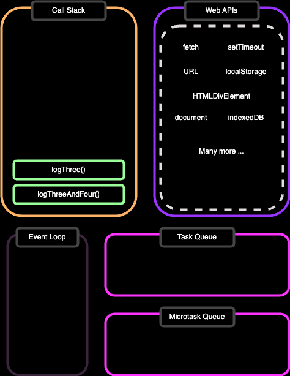
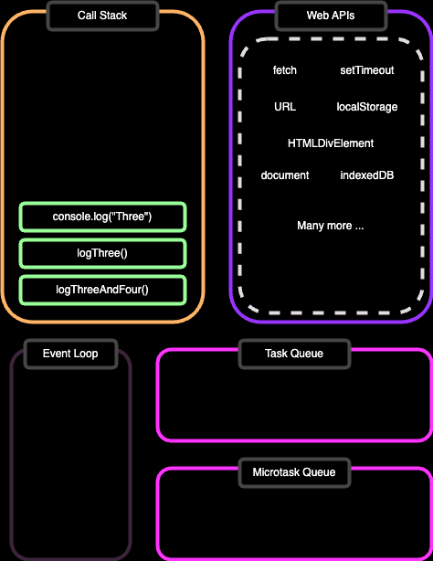
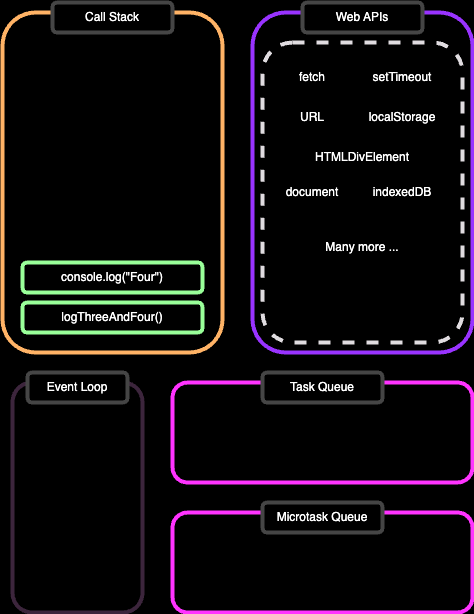
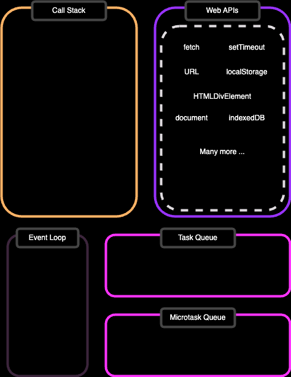
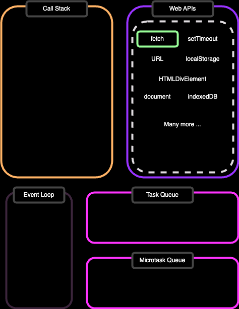
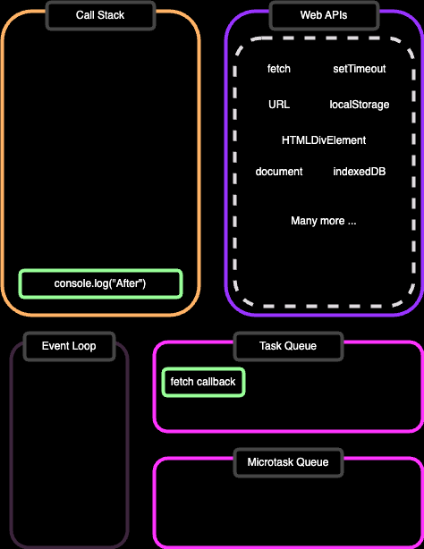
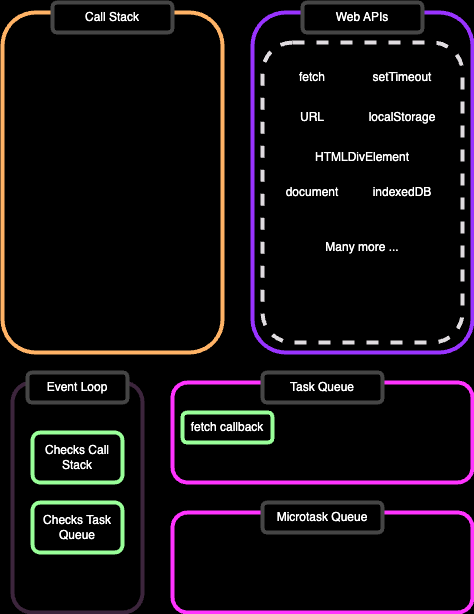
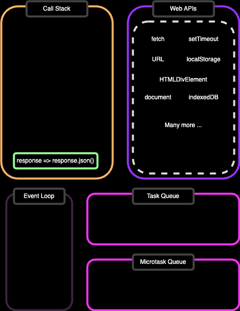
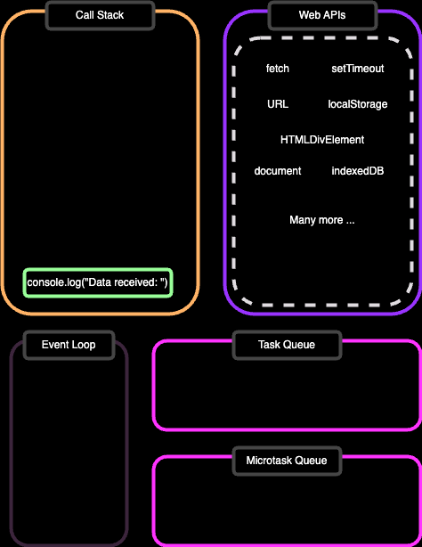

# **Whats going on with Javascript**

---

## About Javascript

_It's a single threaded - meaning one task at a time_

However it has mechanisms to simulate multithreading:

- Asynchronous
- Web Workers

---

<style scoped>
    p {
        margin-top: 150px;
        text-align:center;
    }
</style>

## JS Event Loop

**This is the fundamental mechanism for how JS is executed within the web browser.**

---

## How It works

1. Call Stack:
   - JS code executed in stack-based manner
2. Message Queue:
   - Holds tasks waiting to be executed
3. Event Loop
   - Continuously checks
     - If Call Stack is empty
     - If there are any tasks in message queue

---



---

```js
console.log("One");

console.log("Two");

function logThree() {
  console.log("Three");
}

function logThreeAndFour() {
  logThree();
  console.log("Four");
}

logThreeAndFour();
```

---


```js
console.log("One"); // Here

console.log("Two");

function logThree() {
  console.log("Three");
}

function logThreeAndFour() {
  logThree();
  console.log("Four");
}

logThreeAndFour();
```

---


```js
console.log("One");

console.log("Two"); // Here

function logThree() {
  console.log("Three");
}

function logThreeAndFour() {
  logThree();
  console.log("Four");
}

logThreeAndFour();
```

---


```js
console.log("One");

console.log("Two");

function logThree() {
  console.log("Three");
}

function logThreeAndFour() {
  logThree();
  console.log("Four");
}

logThreeAndFour(); // Here
```

---



```js
console.log("One");

console.log("Two");

function logThree() {
  console.log("Three");
}

function logThreeAndFour() {
  logThree(); // Here
  console.log("Four");
}

logThreeAndFour();
```

---



```js
console.log("One");

console.log("Two");

function logThree() {
  console.log("Three"); // Here
}

function logThreeAndFour() {
  logThree();
  console.log("Four");
}

logThreeAndFour();
```

---



```js
console.log("One");

console.log("Two");

function logThree() {
  console.log("Three");
}

function logThreeAndFour() {
  logThree();
  console.log("Four"); // Here
}

logThreeAndFour();
```

---



```js
console.log("One");

console.log("Two");

function logThree() {
  console.log("Three");
}

function logThreeAndFour() {
  logThree();
  console.log("Four");
}

logThreeAndFour();
```

---

## What happens when we use Web APIs

- For example fetch/setTimeout

This allows to offload long running tasks on to browser

Which means that UI can remain responsive

---

```js
console.log("Before");

fetch("https://api.example.com/data")
  .then((response) => response.json())
  .then((data) => {
    console.log("Data received:", data);
  });

console.log("After");
```

---


```js
console.log("Before"); // Here

fetch("https://api.example.com/data")
  .then((response) => response.json())
  .then((data) => {
    console.log("Data received:", data);
  });

console.log("After");
```

---



```js
console.log("Before");

fetch("https://api.example.com/data") // Here
  .then((response) => response.json())
  .then((data) => {
    console.log("Data received:", data);
  });

console.log("After");
```

---



```js
console.log("Before");

fetch("https://api.example.com/data")
  .then((response) => response.json())
  .then((data) => {
    console.log("Data received:", data);
  });

console.log("After"); // Here
```

---



```js
console.log("Before");

fetch("https://api.example.com/data")
  .then((response) => response.json())
  .then((data) => {
    console.log("Data received:", data);
  });

console.log("After");
```

---



```js
console.log("Before");

fetch("https://api.example.com/data")
  .then((response) => response.json())
  .then((data) => {
    console.log("Data received:", data);
  });

console.log("After");
```

---



```js
console.log("Before");

fetch("https://api.example.com/data")
  .then((response) => response.json())
  .then((data) => {
    console.log("Data received:", data);
  });

console.log("After");
```

---

```js
console.log("Before");

console.time();

setTimeout(() => {
  console.timeEnd();
}, 100);

console.log("After");
```

---

MDN docs
https://developer.mozilla.org/en-US/docs/Web/JavaScript/Event_loop

Talks about this:

JavaScript Visualized - Event Loop, Web APIs, (Micro)task Queue
https://youtu.be/eiC58R16hb8?si=6jqQLWdVpVcCGt1d

What the heck is the event loop anyway https://youtu.be/8aGhZQkoFbQ
